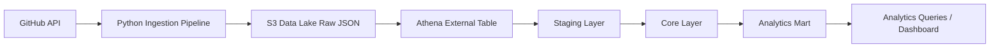

# GitHub Events Data Pipeline Architecture

```mermaid
flowchart LR

A[GitHub API] --> B[Python Ingestion Pipeline]

B --> C[S3 Data Lake Raw JSON]

C --> D[Athena External Table]

D --> E[Staging Layer]
E --> F[Core Layer]
F --> G[Analytics Mart]

G --> H[Analytics Queries / Dashboard]
```
